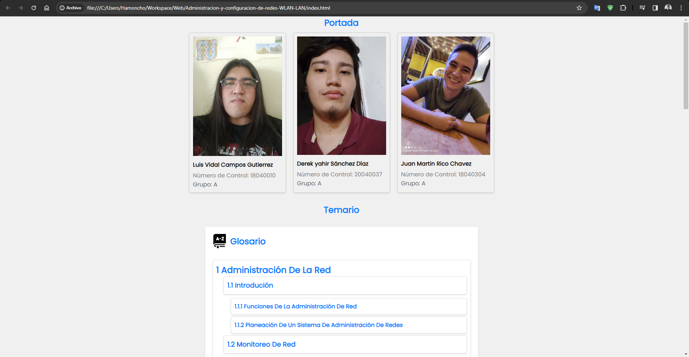
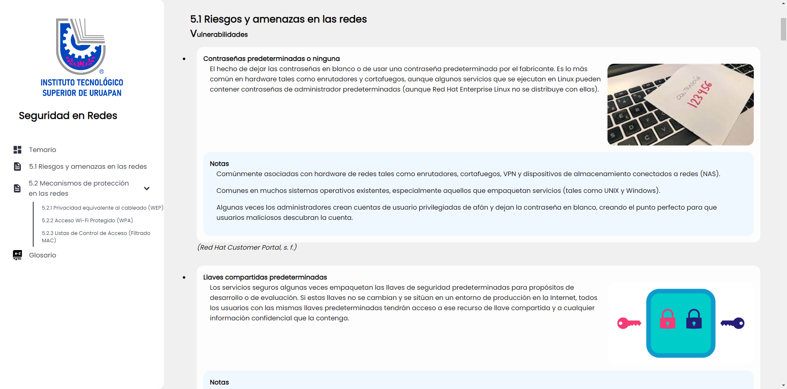
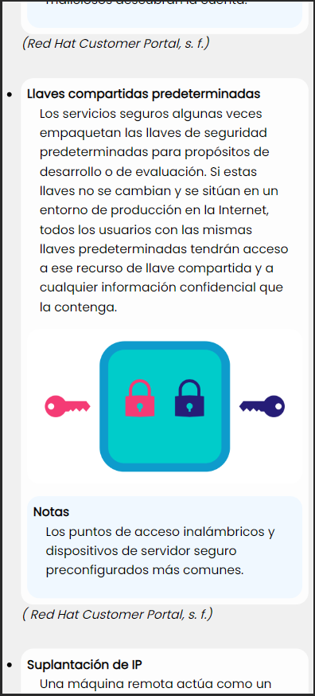

Trabajo final para la materia de administracion y configuracio nde redes wlan lan, es un resumen de todo lo visto durante la clase pero en formato web.

## Tabla de Contenidos

- [Instalación](#instalación)
- [Capturas de Pantalla](#capturas-de-pantalla)

## Capturas de Pantalla

## Instalación

Unicamente es necesario mover el proyecto a una servidor web. 

